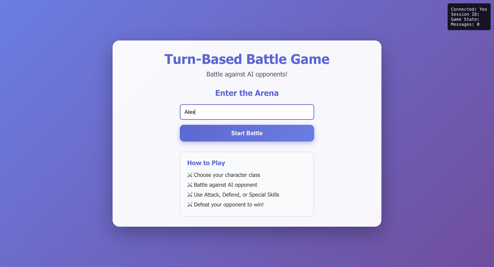
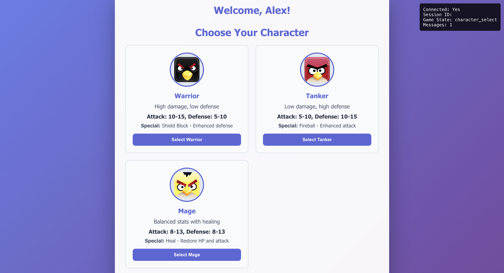
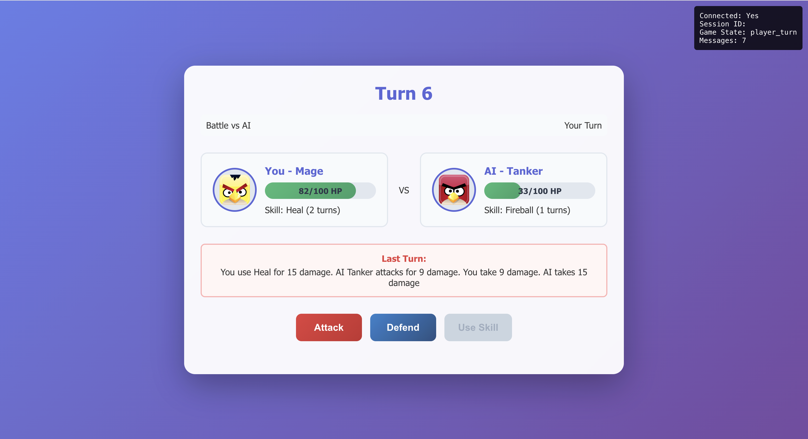
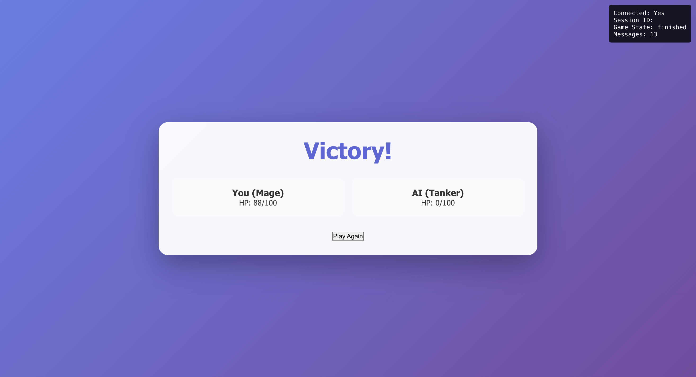

# Battle Grounds - Turn-Based Battle Game

A web-based **Player vs AI** battle game with React frontend and FastAPI backend, featuring real-time WebSocket communication for smooth and strategic gameplay.

## 🚀 Highlights:
- 🎮 **Real-time AI Battles**: WebSocket-powered, low-latency communication
- 🧙 **Unique Character Classes**: Warrior, Tanker, and Mage with distinct skills
- 🧠 **Strategic Turn-Based Combat**: Attack, defend, or cast special abilities
- 📱 **Responsive UI**: Modern React interface, mobile-friendly

## 🛠 Tech Stack:
- **Frontend**: React + TypeScript, Custom WebSocket Hook, CSS3
- **Backend**: FastAPI, WebSocket, Pydantic, Python 3.9+
- **Deployment**: Frontend on Vercel, Backend on Render
- **CI/CD**: GitHub Actions (test, lint, deploy)

## 🏗 Architecture:
- React (UI + WebSocket)  ⇄  FastAPI (API + Game Logic + WebSocket Hub)

## 🎮 Gameplay Flow:
- Select your character class
- Take turns choosing actions (Attack / Defend / Skill)
- Battle until one player’s HP reaches zero

## 📸 Screenshots: 
   
   
   
   

## 🚀 Quick Start:
   ### Backend
   ```
   cd backend
   pip install -r requirements.txt
   python run.py
   ```

   ### Frontend
   ```
   cd frontend
   npm install
   npm start
   ```

Open at: http://localhost:3000 (Frontend) + http://localhost:8000 (API)
